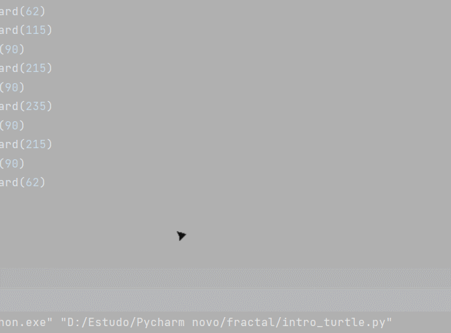
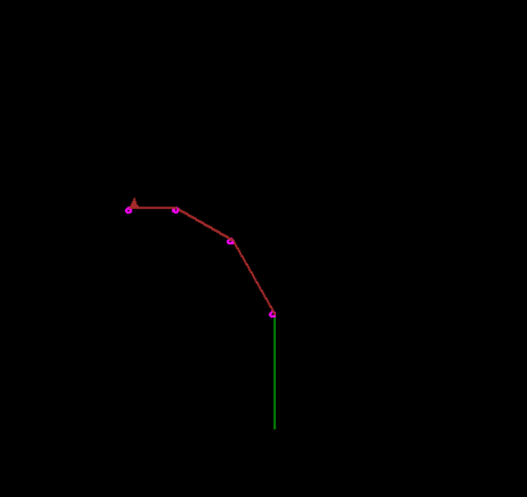
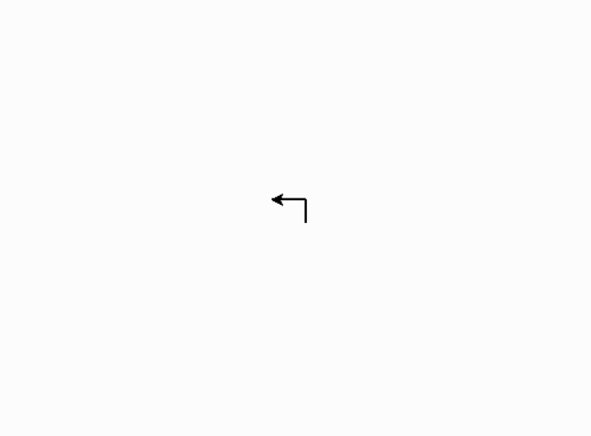
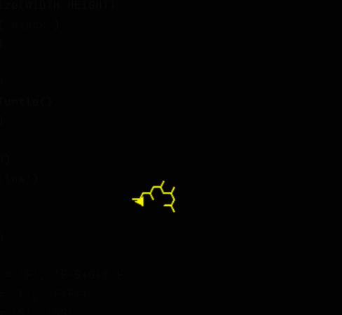
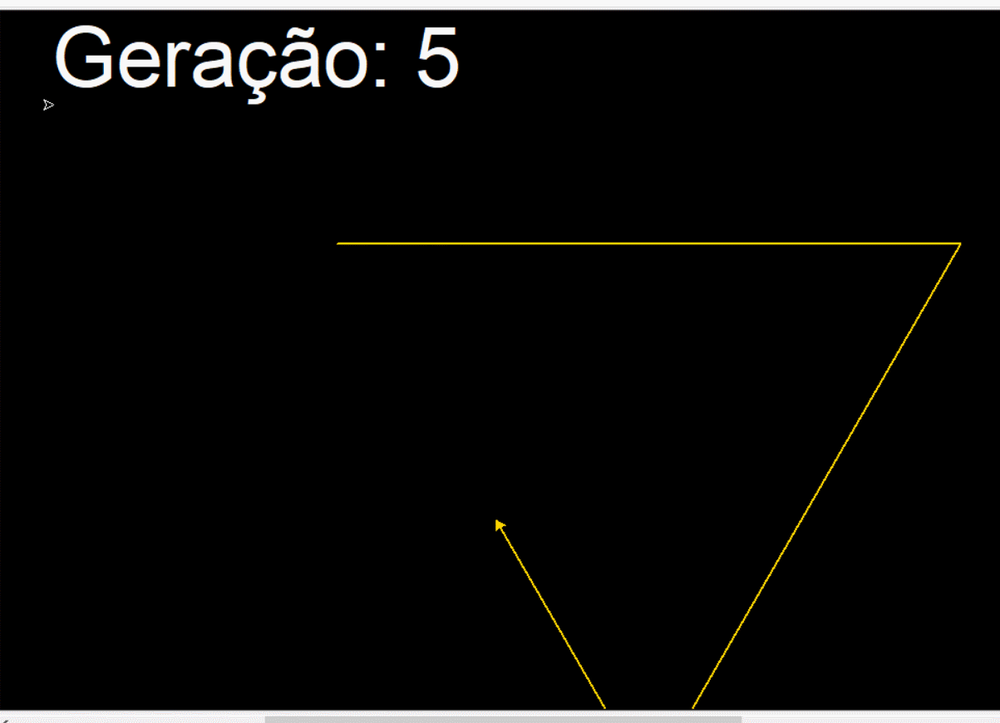
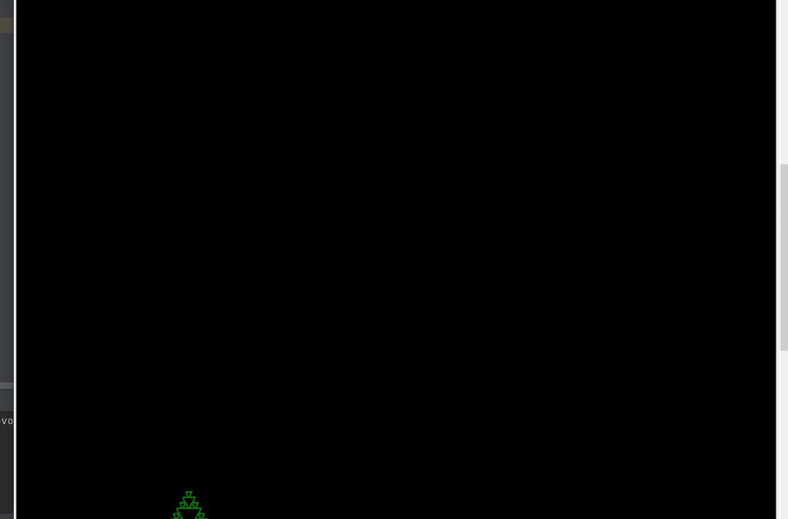
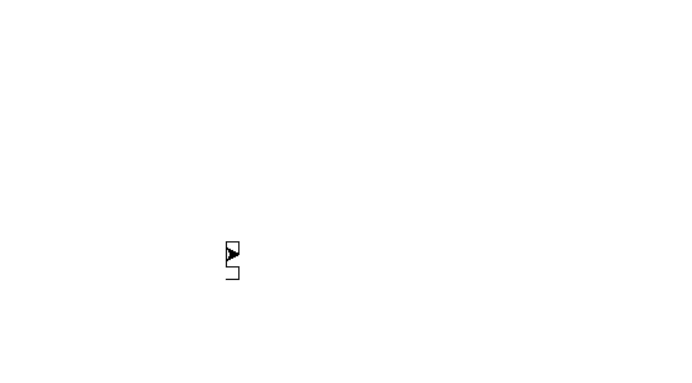

# Fractal
Apenas alguns testes e brincadeira realizadas com fractais 
e com a biblioteca Turtle do python.

### O que é um fractal?
Fractal é uma figura geométrica onde suas pequenas partes 
se assemelham a uma versão pequena da imagem completa.

### Turtle
O primeiro passo é entender como funciona a biblioteca Turtle,
que é utilizada para realizar os desenhos.

Os comandos são relativamente simples para quem tem um conhecimento 
básico de inglês, já que os comandos mais utilizada são:
- turtle.left
- turtle.right
- turtle.foward

E com poucas linhas de código, se consegue fazer alguns desenhos como
os seguintes:

Ou talvez algo mais complexo como uma árvore:

Também podendo ser adicionado um pouco de lógica de programação, temos algo como:

### Turtle + Fractal

Utilizando a biblioteca Turtle em conjunto com a lógica matemática dos 
fractais, é possivel criar infinitas combinações para formar imagens e 
padrões surpreendentes.

### Padrão de floco: 

O padrão a seguir é um ótimo exemplo de como funciona a lógica dos fractais.

Sendo que sempre ocorre uma nova geração, as mudanças de acordo com as 
regras propostas no código são aplicadas.

Porém, esse é apenas um padrão relativamente simples.

Devido a sua natureza de substituir suas caracteristicas com outras de 
acordo com suas regras, uma imagem realizada por fractal pode ficar um 
tanto quanto complexa.

Como por exemplo o gif a seguir, criada completamente
utilizando a lógica de fractais, e se trata do Fractal de Hilbert.

Porém devido ao fato de como o código funciona, ele está diferente do "original",
segue o gif que como funciona o "original":

